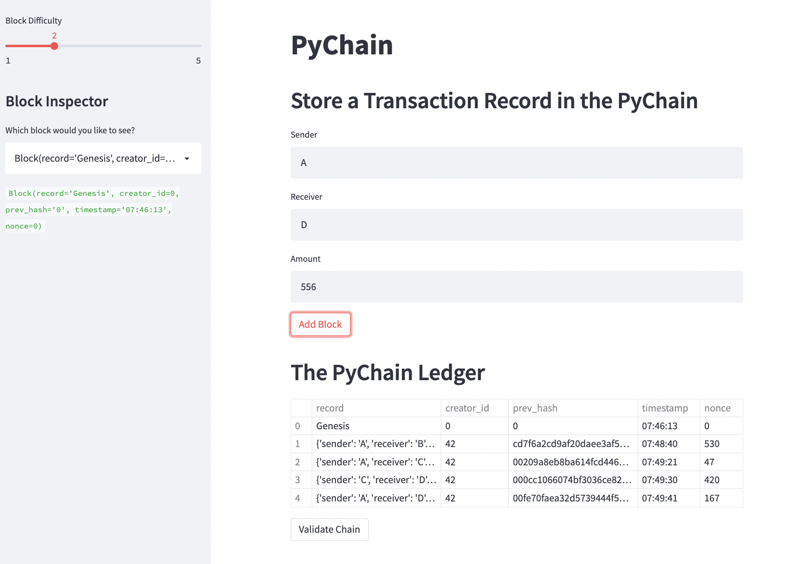
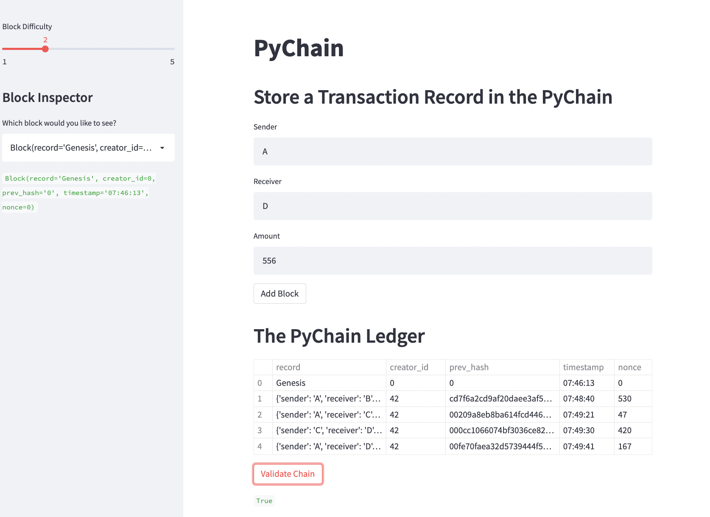

# PyChain Ledger – Results

## Blockchain with multiple blocks

Screenshot detailing a blockchain that consists of multiple blocks.

## Validity of blockchain

Tested blockchain using validation process in the web interface.

